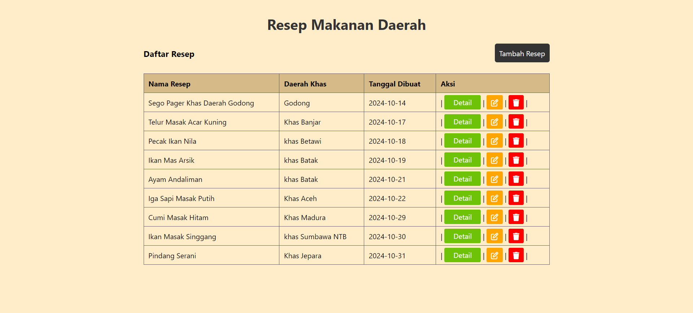
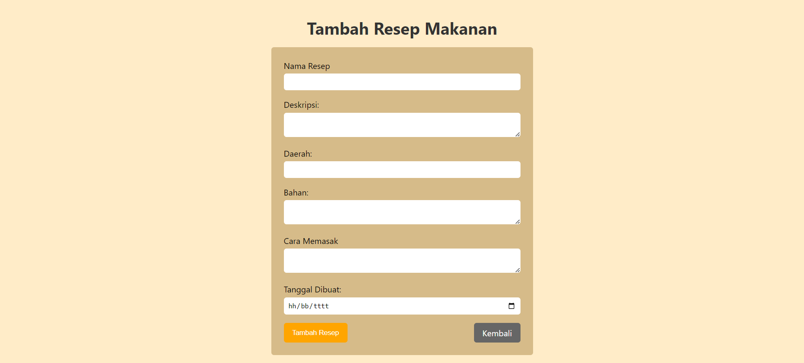
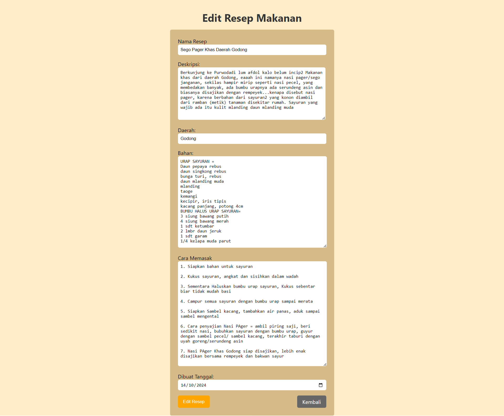
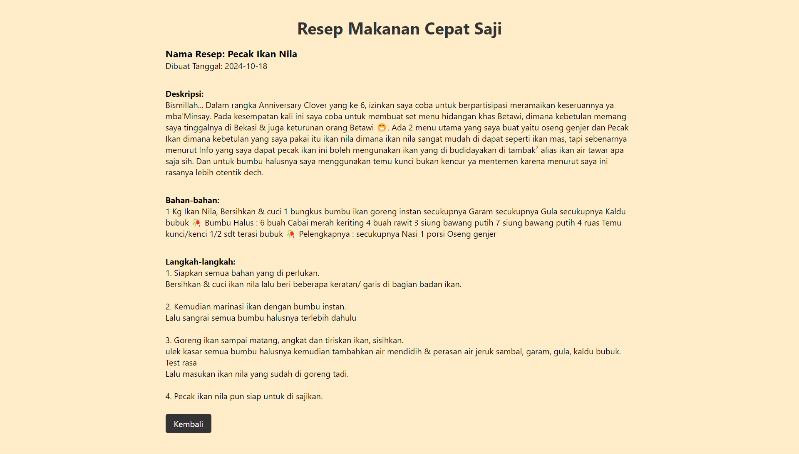

# 📜 Aplikasi Resep Makanan Daerah 🍽️

Selamat datang di **Aplikasi Resep Makanan Daerah**! 🎉  
Aplikasi ini menyajikan berbagai resep makanan tradisional dari berbagai daerah di Indonesia. Mulai dari cara membuat hingga tips-tips khusus yang bisa membantu kamu menciptakan sajian lezat khas Nusantara di dapurmu! 🌶️🍚

## 🚀 Fitur Utama

- **Resep Tradisional**: Tersedia berbagai resep dari berbagai daerah dengan langkah-langkah yang jelas dan mudah diikuti.
- **Tampilan Interaktif**: Antarmuka yang sederhana namun menarik untuk pengalaman pengguna yang menyenangkan.
- **Penyimpanan Data**: Simpan dan kelola data resep menggunakan teknologi **SQLite**.

## 📚 Teknologi yang Digunakan

Proyek ini dibangun menggunakan teknologi-teknologi berikut:

- **HTML5**: Untuk struktur halaman aplikasi.
- **CSS3**: Untuk styling yang membuat aplikasi lebih menarik dan responsif.
- **PHP**: Untuk logika backend dan pengelolaan data resep.
- **SQLite**: Sebagai database untuk menyimpan data resep makanan daerah.

## 💻 Dokumentasi

Ini adalah halaman Resep, yang dimana pengguna bisa melihat semua resep, dan pengguna juga bisa menambahkan, mengedit, dan menghapus resepnya sendiri.

--------------------------------------------------------

Ini adalah halaman Tambah Resep, yang dimana pengguna bisa menambahkan Resepnya sendiri.

--------------------------------------------------------

Ini adalah halaman Edit Resep, yang dimana pengguna bisa mengedit atau memperbarui kembali resep yang sudah ditambahkannya.

--------------------------------------------------------

Ini adalah halaman detail resep, yang dimana pengguna bisa melihat Resep lebih detail dan terperinci.

-------------------------------------------------------- 

#  🙏🏻Terimakasih Sudah Berkunjung 🙏🏻

Jangan lupa untuk follow dan likenya juga ya teman - teman 😎
